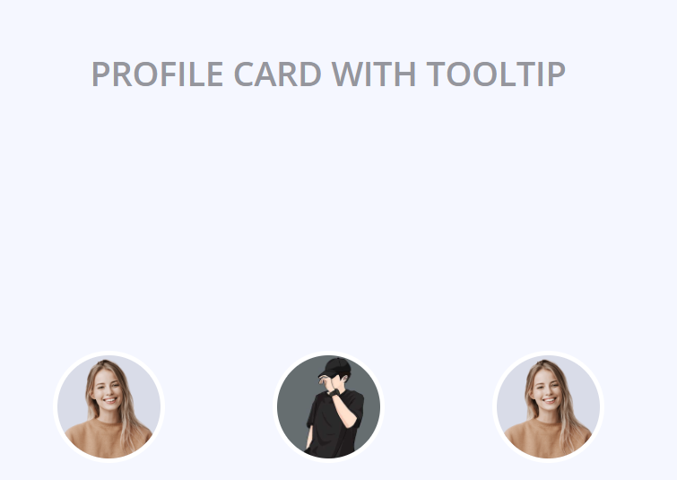
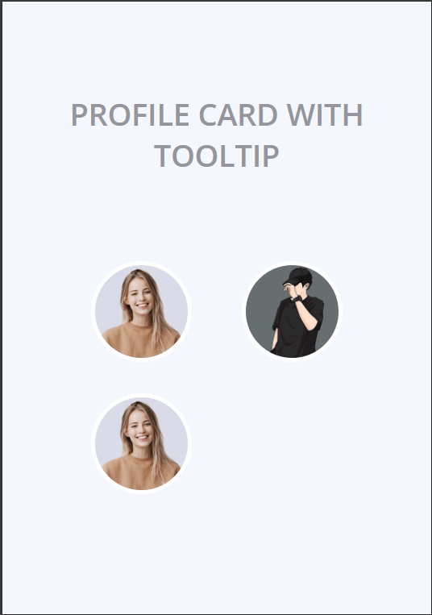

# 🖼️ کارت پروفایل با HTML CSS JavaScript

در این پروژه، چندین نوع گالری با قابلیت‌ها و طراحی‌های متفاوت ارائه شده است. در ادامه، هر یک از این گالری‌ها به طور جداگانه توضیح داده شده است.

### گالری 

  <strong> Gallery </strong>

  
  

### گالری با مدال ساده

  <strong>Gallery With Simple Modal</strong>

  
  

### کارهای آینده
<ul style="list-style-type: none;" dir="rtl">
    <li><input type="checkbox" checked disabled> - [x] انتشار نسخه اولیه </li>
    <li><input type="checkbox" checked> - [x] انتشار نسخه گالری با مدال ساده </li>
    <li><input type="checkbox" checked> - [x] انتشار نسخه گالری با مدال ساده و صفحه بندی </li>
    <li><input type="checkbox" checked> - [x] انتشار گالری با Lightbox2 </li>
    <li><input type="checkbox" checked> - [x] انتشار گالری با Lightbox2 و صفحه بندی </li>
    <li><input type="checkbox" checked> - [x] اضافه کردن عکس و توضیحات </li>
    <li><input type="checkbox" checked> - [ ] رسپانسیو کردن </li>
</ul>

